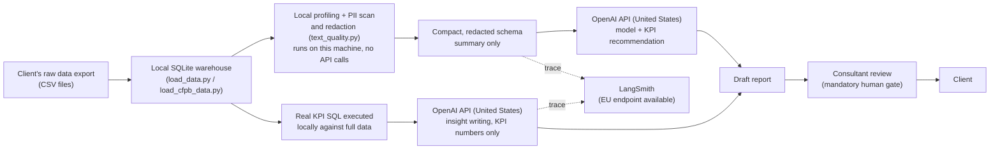

# GDPR Documentation

This is a coursework capstone, written to show the reasoning a real AI Manager would document.
It is not legal advice. A real engagement would need a signed Data Processing Agreement with
each client and review by counsel before going live.

## Who is the controller here

In a real engagement, the client company is the data controller for its own customers' personal
data (their names, order details, complaint narratives, and so on). The consultancy is a
processor, acting only on the client's documented instructions, under a Data Processing
Agreement (Article 28 GDPR). This project's two test datasets (Olist, CFPB) are both public,
not real client data, used as stand-ins for what a real client export looks like, exactly as
`research/sector_research.md` describes.

## Data flow map

The key property this diagram is meant to show: raw client rows never cross step C. Only a
redacted schema summary (step D) and computed KPI numbers (step F to G) ever reach OpenAI. This
is enforced in code, not just policy, see `pipeline/pipeline_documentation.md`'s "Where the AI
is actually called" table.

## Processing activities register

| Activity | Purpose | Data categories | Legal basis | Retention | Recipients |
|---|---|---|---|---|---|
| Loading a client export into SQLite | Stand up the working copy the pipeline runs against | Whatever the client's export contains: transaction records, complaint narratives, and so on, possibly including personal data in free text | Performance of the consultancy's contract with the client (client is controller, consultancy is processor under a DPA) | Deleted after the engagement's review period ends, not retained indefinitely | None outside the consultancy |
| Local data quality profiling | Assess completeness and structure before modeling | Column-level statistics, not individual records | Same as above | Same as above | None |
| Local free text PII scan and redaction | Flag and mask personal data in free text before anything leaves the local machine | Free text fields, scanned locally, only aggregate counts and redacted samples are kept afterward | Same as above, and also a GDPR Article 25 (data protection by design) control in its own right | Redacted output only; the pre-redaction text is never written to `outputs/` | None, this step runs entirely locally |
| Schema summary and KPI recommendation | Get an AI-drafted data model and KPI list | Redacted schema statistics only, no raw rows | Same as above | Per OpenAI's API data usage terms (not used for training by default; see the Third-party transfers section) | OpenAI (United States) |
| KPI SQL execution | Compute real business numbers | Aggregate query results, not raw rows returned to the AI | Same as above | Kept in `outputs/report.json` for the engagement's review period | None |
| Insight writing | Draft the plain-language report | Computed KPI numbers and quality findings only | Same as above | Same as `outputs/report.json` | OpenAI (United States) |
| LangSmith tracing | Let a consultant review every AI decision | The same redacted prompts and outputs described above | Legitimate interest (internal quality assurance and auditability) | Per the LangSmith workspace's own retention settings | LangSmith (EU endpoint available, see `.env.example`) |

## Short DPIA: free text PII scan and redaction

This is the highest-risk processing step in the pipeline, so it gets the DPIA, per Article 35.

**Why this step is in scope for a DPIA:** the pipeline processes personal data at meaningful
scale (the CFPB test run covered 17.4 million complaint records, about 3.8 million of them with
a free text narrative), and free text is exactly where personal data hides unpredictably,
already confirmed in this project's own testing: 56 to 63.5 percent of sampled CFPB narratives
contained a detected person name, even after CFPB's own redaction pass. Some narratives can also
touch special category data (health conditions mentioned in a debt or insurance complaint, for
example), which raises the stakes further.

**Necessity and proportionality:** the scan only needs to detect whether personal data is
present, not identify who it belongs to, so it does not need to retain matches. The
implementation reflects that: `text_quality.py::scan_column_for_pii` returns entity-type counts
and percentages only, never the matched text or which row matched, and
`text_quality.py::redact_sample` masks detected entities before a sample value is stored
anywhere.

**Risks to data subjects:**

- A person's name, phone number, or location mentioned in a complaint or review reaching a
  third-party AI provider (OpenAI) as part of a "sample value." This was a real, latent bug in
  Round 1, see `feedback/round1_decision.md`, fixed in Round 2 by redacting before anything is
  added to the schema summary.
- The local PII scanner missing something, particularly on non-English text (it uses an English
  spaCy model) or an unusual format, giving a false sense of safety.
- Large-scale processing amplifying a small per-record risk. Even a low false-negative rate
  affects a meaningful number of real people at 17 million records.

**Mitigations already in place:**

- Detection and redaction both run locally, nothing reaches OpenAI unredacted.
- The AI is explicitly instructed to flag any column with detected PII as a data quality issue,
  and it does, verified in this project's own CFPB test run.
- A human consultant reviews every report before a client sees it, the same control that also
  keeps this project out of the Article 50(2) AI Act content-marking obligation, see
  `compliance/eu_ai_act_compliance.md`.
- The scanner's language limitation is documented, not hidden, see
  `pipeline/pipeline_documentation.md`'s "Data structure" section.

**Residual risk:** medium. The local scan and redaction are real, tested controls, but they are
a first pass, not a guarantee, especially outside English. This is why the human review step
stays mandatory rather than optional, and why this is called out again as risk #2 in
`roi_risk_assessment.md`'s risk matrix.

## Data subject rights support

Since the consultancy acts as a processor in a real engagement, requests from an individual
(access, correction, erasure, and so on) are the controller's (the client's) responsibility to
respond to, with the consultancy supporting that response under the DPA, per Article 28(3)(e).
In practice, that support means being able to locate and remove a given person's data from a
client's warehouse on request. This capstone does not yet build a dedicated per-person
search-and-erase tool, that is a real gap for a production version, and is listed as a
full-deployment hardening item in `strategic_plan.md`.

## Third-party and cross-border transfers

| Recipient | Location | What it receives | Transfer mechanism |
|---|---|---|---|
| OpenAI | United States | Redacted schema summaries and computed KPI numbers, never raw client rows | OpenAI's standard contractual clauses / EU-US Data Privacy Framework participation, would need to be confirmed and documented in the client DPA before any real engagement |
| LangSmith | United States by default, EU available | The same redacted prompts and outputs sent to OpenAI, for audit trace purposes | `.env.example` already documents `LANGSMITH_ENDPOINT=https://eu.api.smith.langchain.com` as an EU data residency option, this should be the default for any EU client |
| Presidio (local PII scan) | Runs on the consultant's own machine | Nothing, it is a local library, not a service | Not a transfer, no data leaves the machine for this step |

A real engagement would need this table checked against whatever DPA is signed with the client,
and against the specific OpenAI and LangSmith account terms in force at the time, since transfer
mechanisms and certifications can change.
