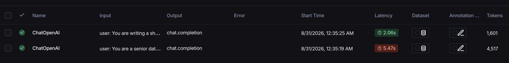

# LangSmith Monitoring Sample

## Setup

1. Sign up for free at https://smith.langchain.com and create a Personal API key
2. Add this to `.env`:
   ```
   LANGSMITH_API_KEY=...
   LANGSMITH_TRACING=true
   LANGSMITH_PROJECT=data-copilot-round1
   ```
   If your workspace uses EU data residency (check Settings -> General in the LangSmith
   UI), also add `LANGSMITH_ENDPOINT=https://eu.api.smith.langchain.com`, otherwise every
   call fails with a 403 error even though the key is valid, since it is being sent to the
   wrong region's server.
3. Run `python pipeline/run_pipeline.py`. Every OpenAI call inside
   `pipeline/model_kpi_generator.py` is traced automatically, through
   `langsmith.wrappers.wrap_openai`. No extra code is needed.
4. View the traces at smith.langchain.com, under the `data-copilot-round1` project.

## What is being monitored, and why

Two separate AI decision points are traced on every pipeline run:

1. **Model and KPI generation.** The prompt (the schema profile) and the full response (the
   recommended model, the KPI list with SQL, the quality findings, and the data science
   suggestions).
2. **Insight generation.** The prompt (the executed KPI values and quality findings) and the
   response (the plain language business insights).

This is the direct answer to Chleo's fear that "the AI" is not transparent. Every recommendation
the system makes is logged with its full input and reasoning. A consultant, or in principle the
client, can review it before it is acted on. It is not a black box.

## What it shows about transparency and observability

- Full input and output for every AI decision, not just a final answer
- Because the KPI SQL actually runs, failures are visible in the trace too. This is an honest
  observability story, not a cherry picked demo.
- Latency and token count are recorded per call too, useful for the cost estimate in
  `cost_estimation/cost_analysis.md`.

Example: two runs from a single pipeline run, both traced with full input/output, latency,
and token count.


